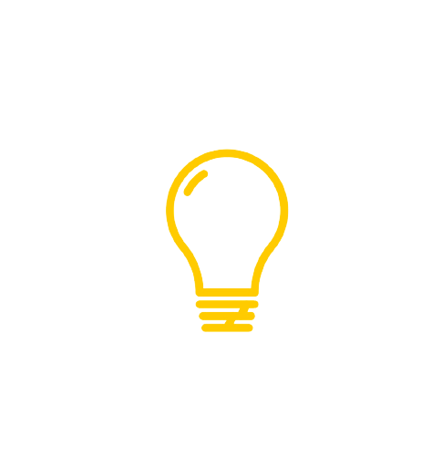

##  About Me
안녕하세요! 백엔드 개발에 빠져 살아가는 개발자입니다. 데이터의 흐름을 효율적으로 관리하고, 안정적이고 확장 가능한 서버 시스템을 구축하는 것을 즐깁니다. 주로 [언어/기술/도구]를 활용하여 사용자 경험을 향상시키는 백엔드 솔루션을 디자인하고 개발합니다. 코드뿐만 아니라 깔끔한 설계와 문서화를 중요하게 여기며, 항상 새로운 도전을 통해 성장하려 노력하고 있습니다. 함께 일하고 학습하는 것을 좋아하니, 언제든 연락 주세요!
  

##  My Skills
### Front-End
</a>&nbsp;
</a>&nbsp;
</a>&nbsp;
</a>&nbsp;
### Back-End
</a>&nbsp;
</a>&nbsp;
</a>&nbsp;

</a>&nbsp;
</a>&nbsp;

### Server
</a>&nbsp;
</a>&nbsp;
</a>&nbsp;

### Tools
</a>&nbsp;
</a>&nbsp;
</a>&nbsp;
</a>&nbsp;
</a>&nbsp;

#  Contract
Blogs : https://victoryddh5-doha.tistory.com

E-Mail : victoryddh@gmail.com

Portfolio : 

  
## BaekJoon Online Judge
